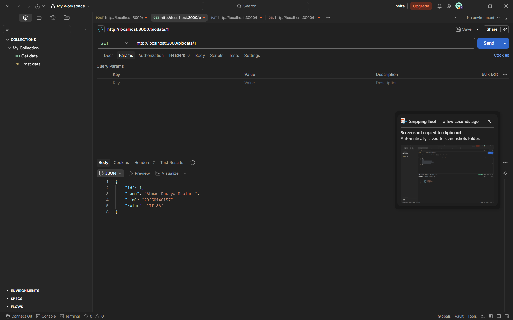
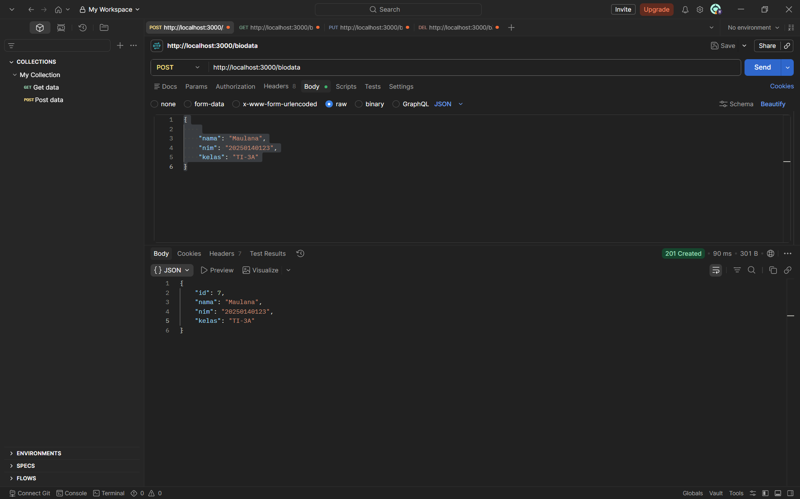
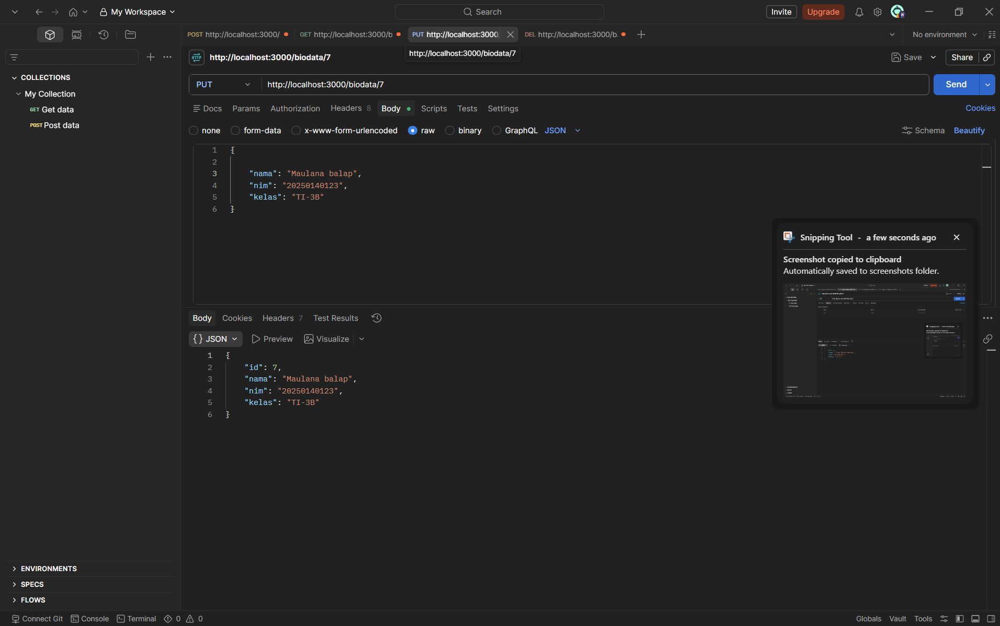
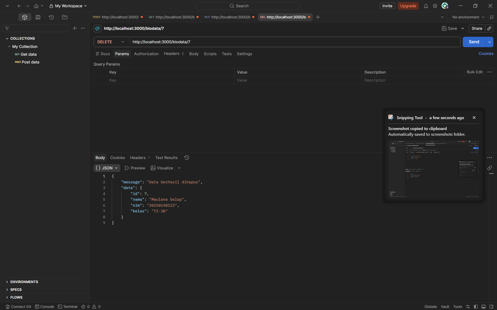

# CRUD Express.js + PostgreSQL

Aplikasi REST API sederhana untuk CRUD data biodata mahasiswa menggunakan Express.js dan PostgreSQL.

## Prasyarat

- [Node.js](https://nodejs.org/)
- [PostgreSQL](https://www.postgresql.org/)
- [Postman](https://www.postman.com/) (untuk testing API)

## Struktur Database

```sql
CREATE DATABASE mahasiswa;

CREATE TABLE biodata (
    id SERIAL PRIMARY KEY,
    nama VARCHAR(100),
    nim VARCHAR(20),
    kelas VARCHAR(10)
);

INSERT INTO biodata (nama, nim, kelas) VALUES
('Ahmad Rassya Maulana', '20250140157', 'TI-3A'),
('Budi Santoso', '20250140158', 'TI-3A'),
('Citra Lestari', '20250140159', 'TI-3B'),
('Dewi Sartika', '20250140160', 'TI-3B'),
('Eko Prasetyo', '20250140161', 'TI-3C'),
('Fani Rahmawati', '20250140162', 'TI-3C');
```

## Cara Menjalankan

```bash
npm install
node index.js
```

Server akan berjalan di `http://localhost:3000`.

## Endpoint API

| Method | URL                | Deskripsi             |
|--------|--------------------|-----------------------|
| GET    | `/biodata`         | Ambil semua data      |
| GET    | `/biodata/:id`     | Ambil data by ID      |
| POST   | `/biodata`         | Tambah data baru      |
| PUT    | `/biodata/:id`     | Update data by ID     |
| DELETE | `/biodata/:id`     | Hapus data by ID      |

## Panduan Testing dengan Postman

### 1. GET semua data

Ambil seluruh data biodata.

- **Method:** `GET`
- **URL:** `http://localhost:3000/biodata`
- **Body:** tidak perlu



**Response:**
```json
[
  { "id": 1, "nama": "Ahmad Rassya Maulana", "nim": "20250140157", "kelas": "TI-3A" },
  { "id": 2, "nama": "Budi Santoso", "nim": "20250140158", "kelas": "TI-3A" },
  { "id": 3, "nama": "Citra Lestari", "nim": "20250140159", "kelas": "TI-3B" },
  { "id": 4, "nama": "Dewi Sartika", "nim": "20250140160", "kelas": "TI-3B" },
  { "id": 5, "nama": "Eko Prasetyo", "nim": "20250140161", "kelas": "TI-3C" },
  { "id": 6, "nama": "Fani Rahmawati", "nim": "20250140162", "kelas": "TI-3C" }
]
```

### 2. GET data by ID

Ambil satu data berdasarkan ID.

- **Method:** `GET`
- **URL:** `http://localhost:3000/biodata/1`
- **Body:** tidak perlu

**Response:**
```json
{ "id": 1, "nama": "Ahmad Rassya Maulana", "nim": "20250140157", "kelas": "TI-3A" }
```

### 3. POST tambah data

Menambahkan data baru ke tabel biodata.

- **Method:** `POST`
- **URL:** `http://localhost:3000/biodata`
- **Headers:** `Content-Type: application/json`
- **Body (raw JSON):**
```json
{
    "nama": "Gilang Pratama",
    "nim": "20250140163",
    "kelas": "TI-3A"
}
```



**Response (status 201):**
```json
{ "id": 7, "nama": "Gilang Pratama", "nim": "20250140163", "kelas": "TI-3A" }
```

### 4. PUT update data

Mengupdate data berdasarkan ID.

- **Method:** `PUT`
- **URL:** `http://localhost:3000/biodata/2`
- **Headers:** `Content-Type: application/json`
- **Body (raw JSON):**
```json
{
    "nama": "Budi Santoso Updated",
    "nim": "20250140158",
    "kelas": "TI-3B"
}
```



**Response:**
```json
{ "id": 2, "nama": "Budi Santoso Updated", "nim": "20250140158", "kelas": "TI-3B" }
```

### 5. DELETE hapus data

Menghapus data berdasarkan ID.

- **Method:** `DELETE`
- **URL:** `http://localhost:3000/biodata/6`
- **Body:** tidak perlu



**Response:**
```json
{ "message": "Data berhasil dihapus", "data": { "id": 6, "nama": "Fani Rahmawati", "nim": "20250140162", "kelas": "TI-3C" } }
```

## Data Dummy Testing (JSON)

```json
[
  {
    "method": "GET",
    "url": "http://localhost:3000/biodata",
    "body": null
  },
  {
    "method": "GET",
    "url": "http://localhost:3000/biodata/1",
    "body": null
  },
  {
    "method": "POST",
    "url": "http://localhost:3000/biodata",
    "headers": { "Content-Type": "application/json" },
    "body": {
      "nama": "Gilang Pratama",
      "nim": "20250140163",
      "kelas": "TI-3A"
    }
  },
  {
    "method": "PUT",
    "url": "http://localhost:3000/biodata/2",
    "headers": { "Content-Type": "application/json" },
    "body": {
      "nama": "Budi Santoso Updated",
      "nim": "20250140158",
      "kelas": "TI-3B"
    }
  },
  {
    "method": "DELETE",
    "url": "http://localhost:3000/biodata/6",
    "body": null
  }
]
```
